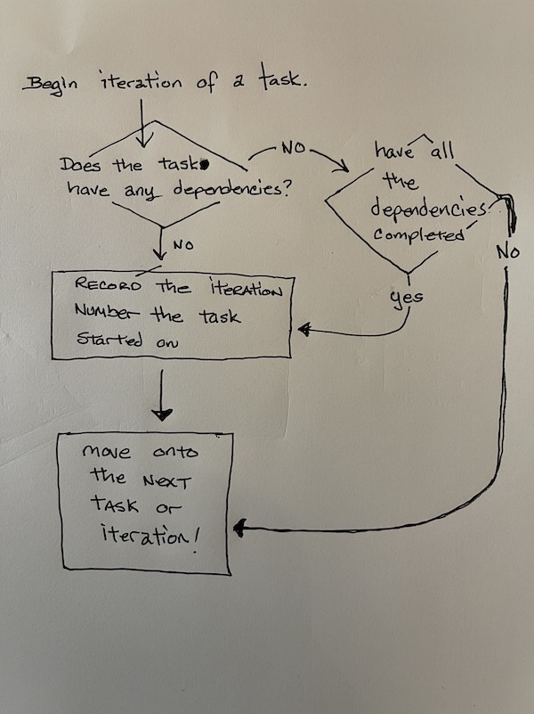

# Software Design Document

## Section 1 - Project Description

1. Project

_**schedule-tasks**_

2. Description

_**schedule-tasks**_ will be a utility written in Rust that will take an input file detailing all the tasks that need to be run, the length of time each task takes to run, and any dependency of tasks that need to be run to completion prior to the task in question is run.  The utility will then create an output file detailing the critical path of the schedule, the minimum duration of the job, and lastly, the max number of tasks that will run in parallel for any cycle of overall job.

3. Revision History

Date | Comment | Author
-----------------------|-----------------------|-----------------------
2022JAN10 | Initial version | David Kayal
2022JAN11 | Change language from python3 to Rust | David Kayal
2022JAN11 | Minor changes and specifications after peer review | David Kayal
2022JAN12 | sample code added to provide logic example | David Kayal
---

## Section 2 - Overview

1. Purpose

This utility program's purpose is to report the details of a determined schedule for the tasks listed in an input file based upon dependencies and runtime length of each task as detailed in the input file.  The report will be a text file detailing the following:
* a critical path of the schedule made up of the longest chain of tasks in the run.
* the minimum duration of the overall job.
* the maximum number of tasks that would run at the same time.

2. Scope

Specific
: The program is to parse the input file, detailing errors by the line number of column of said input file.  Once parsed and determined to be error free, the program is to iterate through all the tasks to see whether each task is allowed to be run based upon its dependencies.  The utility would record the _**IterationNumber**_ the task began.  The program would be keeping track of all the chains of tasks and each chain length.  Additionally, the program would compute the minimum duration of the job possible as based upon the duration of each task's runtime -- or adding the runtime of each Item in a chain length.  Finally, the program would also track the maximum number of tasks that would be running concurrently during the job run.



[code example in Perl](./scratch_pad/code_example.pl) to give example of thought process and algorithms.  This is the data set and output from said example:

Data Set

```perl
my %task;

# start populating the tasks;

#task DNK
$task{ 'DNK' } = {};
$task{ 'DNK' }{runtime} = 1;
$task{ 'DNK' }{iteration_started} = 0;
$task{ 'DNK' }{dependancies} = '';

#task XYZ
$task{ 'XYZ' } = {};
$task{ 'XYZ' }{runtime} = 2;
$task{ 'XYZ' }{iteration_started} = 0;
$task{ 'XYZ' }{dependancies} = 'ABC';

#task ABC
$task{ 'ABC' } = {};
$task{ 'ABC' }{runtime} = 1;
$task{ 'ABC' }{iteration_started} = 0;
$task{ 'ABC' }{dependancies} = '';

#task 101
$task{ '101' } = {};
$task{ '101' }{runtime} = 1;
$task{ '101' }{iteration_started} = 0;
$task{ '101' }{dependancies} = 'DNK,XYZ';
```
Output

```
davidkayal@DAVIDs-MBP candidate-160724967 % ./scratch_pad/code_example.pl
./scratch_pad/code_example.pl
-----
Interation number: 1
-----
----------
DNK
----------
has DNK completed? NO
	There are no dependancies!
	DNK scheduled
----------
XYZ
----------
has XYZ completed? NO
	Dependancies: ABC
	has ABC completed? NO
----------
ABC
----------
has ABC completed? NO
	There are no dependancies!
	ABC scheduled
----------
101
----------
has 101 completed? NO
	Dependancies: DNK,XYZ
	has DNK completed? NO
--------------------------------------------------------------------------------
End of iteration checks:
Checking DNK
has DNK completed? YES
Checking XYZ
has XYZ completed? NO
-----
Interation number: 2
-----
----------
DNK
----------
has DNK completed? YES
----------
XYZ
----------
has XYZ completed? NO
	Dependancies: ABC
	has ABC completed? YES
	XYZ scheduled
----------
ABC
----------
has ABC completed? YES
----------
101
----------
has 101 completed? NO
	Dependancies: DNK,XYZ
	has DNK completed? YES
	has XYZ completed? NO
--------------------------------------------------------------------------------
End of iteration checks:
Checking DNK
has DNK completed? YES
Checking XYZ
has XYZ completed? NO
-----
Interation number: 3
-----
----------
DNK
----------
has DNK completed? YES
----------
XYZ
----------
has XYZ completed? NO
	XYZ already scheduled and running
----------
ABC
----------
has ABC completed? YES
----------
101
----------
has 101 completed? NO
	Dependancies: DNK,XYZ
	has DNK completed? YES
	has XYZ completed? NO
--------------------------------------------------------------------------------
End of iteration checks:
Checking DNK
has DNK completed? YES
Checking XYZ
has XYZ completed? YES
Checking ABC
has ABC completed? YES
Checking 101
has 101 completed? NO
-----
Interation number: 4
-----
----------
DNK
----------
has DNK completed? YES
----------
XYZ
----------
has XYZ completed? YES
----------
ABC
----------
has ABC completed? YES
----------
101
----------
has 101 completed? NO
	Dependancies: DNK,XYZ
	has DNK completed? YES
	has XYZ completed? YES
	101 scheduled
--------------------------------------------------------------------------------
End of iteration checks:
Checking DNK
has DNK completed? YES
Checking XYZ
has XYZ completed? YES
Checking ABC
has ABC completed? YES
Checking 101
has 101 completed? YES
================================================================================
End of Job Report
--------------------------------------------------------------------------------
DNK
	iteration_started	1
	runtime	1
	Job finished at the end of iteration 1
XYZ
	iteration_started	2
	runtime	2
	Job finished at the end of iteration 3
ABC
	iteration_started	1
	runtime	1
	Job finished at the end of iteration 1
101
	runtime	1
	iteration_started	4
	Job finished at the end of iteration 4
davidkayal@DAVIDs-MBP candidate-160724967 %
```

Measurable
: The following are the measure phase lines.

- [ ] The first measurable phase would be the acceptence of this Design Document.
- [ ] Once accepted, the second phase would be to parse the input file and ensuring that there are no errors in the file.
- [ ] The third phase line would be to create objects for each task during parsing of the input file.  Please note that the file is only to be parsed at one time for both error checking and populating of the task objects.
- [ ] The fourth phase would be to iterate through the task objects determining if the task would be allowed to run, whether it is currently running, or it has already completed running.
- [ ] The fifth phase would be to report on the longest chain of tasks in the run, the minimum duration of the job ( i.e. the number of iterations ) and the maximum number of tasks to run during any iteration. 

Achievable
: The computing requirements for this task would be easily handled with the resources available.

Realistic
: The most difficult thing of this project is the parsing of the input file.  The Lexer portion would need to be able to handle input of a task across different lines of the input file. For example the following are all legal ways to express a task's definitions:
```
H(1) after [D,F]

H(1) after
  [D,
   F]

H(1) after
  [D,F]
```  
Time Frame
: A timeframe for the project has not been specifically defined, but it would take a couple days to properly write and debug. 

## Section 3 - System Architecture

This utility will be running on a little macbook pro.

## Section 4 - Data Dictionary

### Task Object

Field | Notes
-----------------------|-----------------------
runtime | This integer details the number of iterations required for this task to complete 
dependencies | a list of tasks that are required to have completed prior to being able to run
IterationStarted | an integer detailing when the task is began to run

### ListOfTasks

This would be a list of all the _Task Objects_ for the job.

### CriticalPath

This would be the _CriticalPath_  for the job.

### MinimumDuration

The _MinimumDuration_ will be the number of interations over the task list required to have all the tasks completed.  This number would be output at the completion of the job.

### MaximumParallelism

The _MaximumParallelism_ will be the highest number of tasks running for any iteration in the job run.  This number will be output at the completion of the job.

## Section 5 - Software Domain Design

This utility will be isolated into its own little silo.  Input will be taken from a text file located on a mounted file system and Output will be STDOUT and written to a text file on the same file system assuming that there are no errors encountered.  If there are errors, STDOUT will be the only output.

## Section 6 - Data Design

Data required and produced by this utility will be stored in text files on the local file system.

## Section 7 - User Interface Design

The user interface would be the cli of a terminal

## Section 8 - Other Interfaces

Not applicable.

## Section 9 - Extra Design Features / Outstanding Issues

* Make sure that all tasks listed in the dependencies of the tasks actually exist!

* Makes sure all tasks are accounted for each iteration as to whether they are running or not. Specifically if a task has a multi-iteration runtime (e.g. A(3) is a task that would run for three iterations)

* Though the examples have been giving Tasks a convention of  a single, capitalized alpha character, Tasks should be allowed to be named with any length of alpha-numeric characters.

## Section 10 - References

Please read the [README.md](./README.md) for background information for this utility. 

## Section 11 - Glossary

job
: For the program, a job is defined by the input file.  The job is made up of all the tasks detailed in the input file.

tasks
: In the input file, tasks are defined as a capitalized alpha character followed by the runtime duration and listing of any dependencies required by the task.

> For example:
>
> **B(1) after [A]**
>
> **B** is the task name
>
> **1** is its runtime duration
>
> **A** is the task name of one of its dependency.

